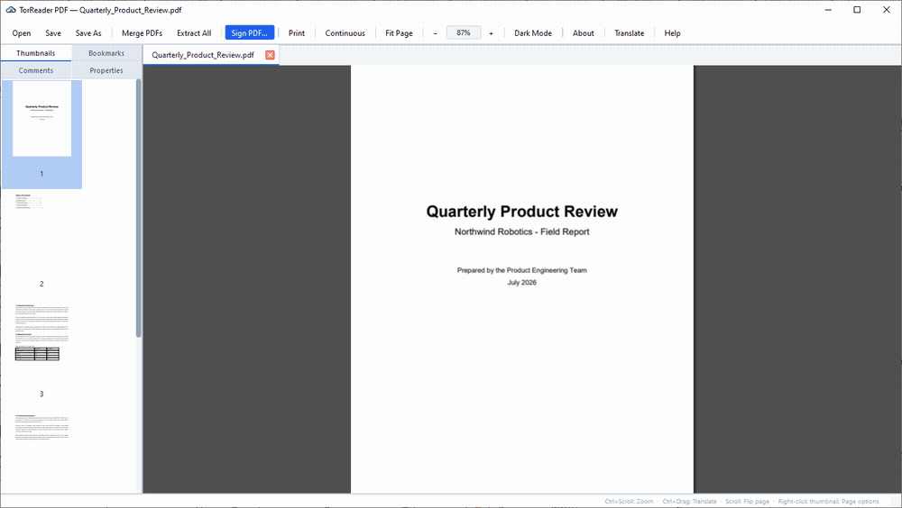
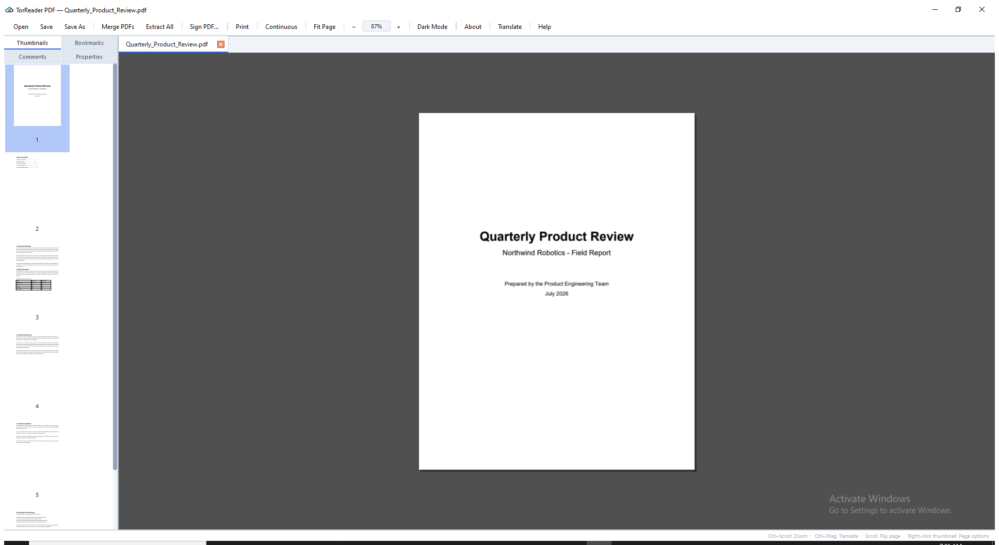
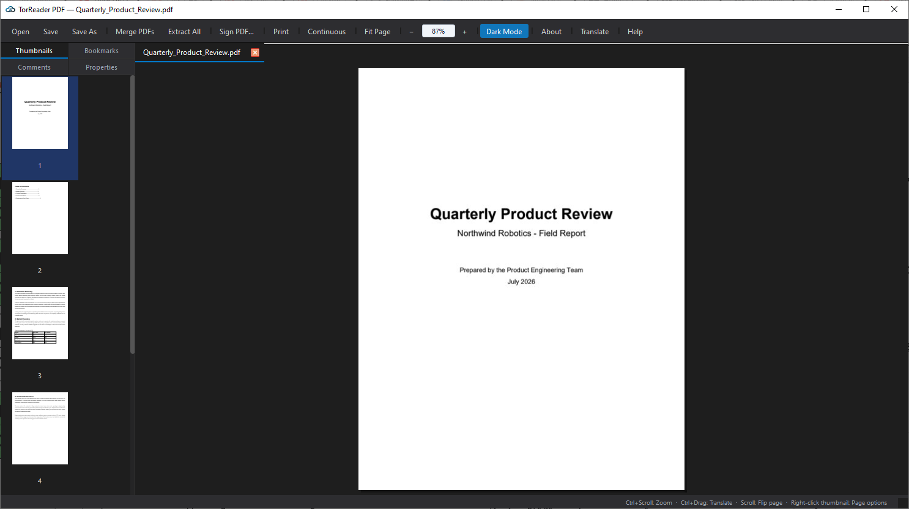
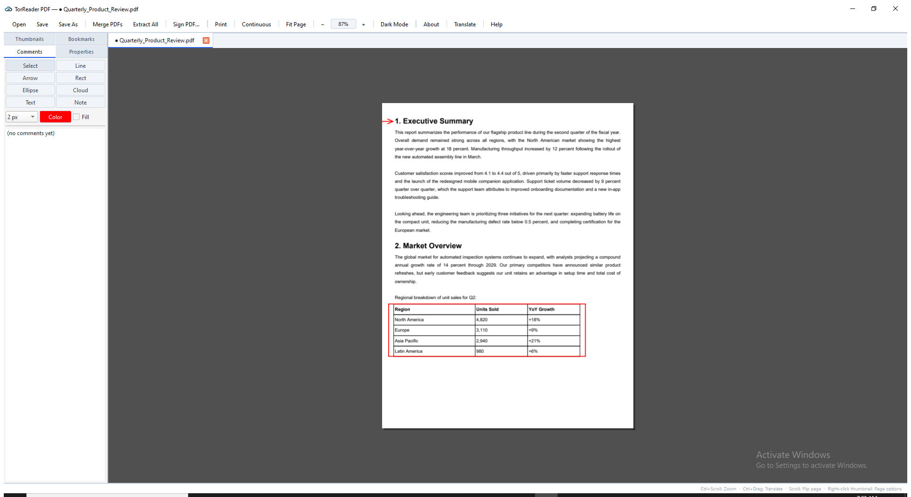
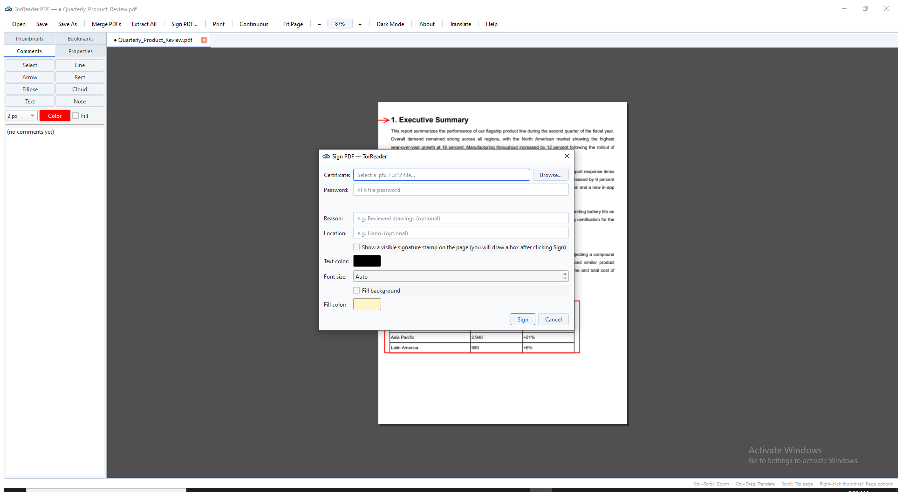
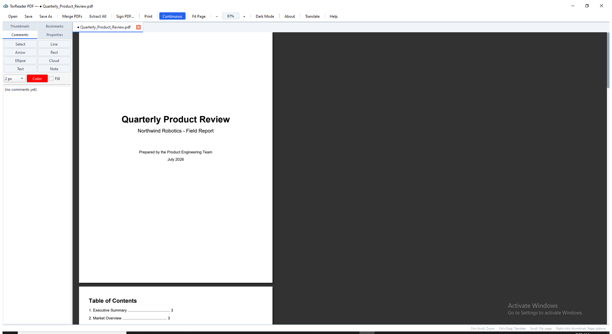
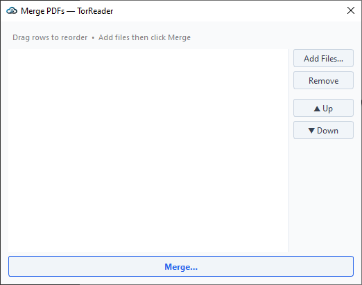

# TorReader PDF

[](https://github.com/FelixNgH/TorreaderPDF/releases/latest)
[](https://github.com/FelixNgH/TorreaderPDF/releases)
[](LICENSE)


**TorReader is a lightweight, portable PDF app for Windows and Linux** — a fast
PDF viewer that also handles the everyday jobs quickly: **merge, extract, split,
and insert** pages, **sign PDFs** digitally, and **translate PDFs for free**.
Everything runs **locally on your machine**, with **no installation required** —
unzip (or `chmod +x`) and run.

Open a 200MB PDF in a second or two, combine files **without losing bookmarks**,
pull out or split pages, insert pages from another PDF, add a digital signature,
and translate text in place — free and open-source (MIT).

### ⬇ Download

| Platform | Download |
|----------|----------|
| **Windows** (x64) | [`TorReaderPDF-2.2-win64.zip`](https://github.com/FelixNgH/TorreaderPDF/releases/latest) — unzip & run `TorReader.exe` |
| **Linux** (x86_64) | [`TorReaderPDF-2.2-x86_64.AppImage`](https://github.com/FelixNgH/TorreaderPDF/releases/latest) — `chmod +x` & run |

See all versions on the **[Releases page](https://github.com/FelixNgH/TorreaderPDF/releases)**.



<details>
<summary>More screenshots (viewer, dark mode, markup, digital signature, merge)</summary>
<br>

| | |
|---|---|
|  |  |
|  |  |
|  |  |

</details>

<!-- Prebuilt binaries and the web version are also at torreader.cloud -->

## Features

- **Fast PDF viewer** — memory-mapped loading opens 200MB files in 1–2s; continuous scroll (RAM-efficient), sharp at every zoom even with mixed page sizes (A4 + A0–A3 in one file)
- **Merge PDF** — combine files while **keeping every bookmark**, remapped to the new page numbers (most tools drop them); unbookmarked pages get an auto "Page N" entry
- **Split PDF** — split a document into parts by page count or size
- **Extract pages** — pull any page or range out into a new PDF
- **Insert pages** — Adobe-style, right-click a thumbnail to insert pages from another PDF; bookmarks renumber to match
- **Sign PDF** — digital signature, PKCS#7 detached, SHA-256, using your own `.pfx`/`.p12` certificate; optional visible signature stamp, placed by dragging then confirmed with "Finalize Signature"
- **Comments (markup)** — Line, Arrow, Rectangle, Ellipse, Cloud, Text box, and sticky Note tools with color/width/fill controls; select, move, and undo/redo any markup
- **Translate PDF (free)** — Ctrl+drag over text to translate it in place, cached locally
- **Delete / Reorder pages**, reorder bookmarks
- **Dark mode**, full keyboard shortcuts (press **F1** in-app for the full list)
- **Safe save model** — edits (insert/delete/reorder/merge) apply to an in-memory working copy first; your original file is only overwritten when you press **Ctrl+S**

## FAQ

**Is TorReader free?** Yes — free and open-source (MIT). No ads, no account, no watermark.

**Do I need to install it?** No. It's a portable app: on Windows, unzip and run
`TorReader.exe`; on Linux, `chmod +x` the AppImage and run it.

**Does it work offline?** Yes — all PDF viewing and editing (merge, split, extract,
insert, sign) happens locally on your machine. Only the optional translate feature
calls an online translation service when you use it.

**Can it merge PDFs without losing bookmarks?** Yes. Merging (and inserting pages)
keeps every bookmark and remaps it to the new page numbers — a common problem with
other free tools.

**What platforms are supported?** Windows 10/11 (x64) and Linux (x86_64, AppImage).

**Is it a free alternative to Adobe Acrobat, PDFsam or Foxit?** For viewing, merging,
splitting, extracting, inserting, signing and translating PDFs — yes, TorReader
covers those jobs in a single lightweight, portable app.

## Building from source

### Requirements (both platforms)
- CMake ≥ 3.25
- Qt 6 (Core, Widgets, Gui, Concurrent, PrintSupport, OpenGL, OpenGLWidgets, Network)
- [Rust](https://rustup.rs/) + Cargo (builds the `formibpdf` preview-rendering helper)
- QPDF ≥ 11 (dev headers)
- **PDFium** prebuilt binaries — download from
  [bblanchon/pdfium-binaries releases](https://github.com/bblanchon/pdfium-binaries/releases)
  and extract into `third_party/pdfium/` (must contain `include/`, `lib/`,
  and on Windows `bin/pdfium.dll`)
- *(optional)* OpenSSL dev headers — enables the "Sign PDF" feature. Skipped
  cleanly if not found.
- *(optional)* Tesseract OCR dev headers — enables OCR search on scanned pages.

### Windows
```powershell
# Requires Visual Studio Build Tools 2022 + vcpkg (for QPDF/OpenSSL)
vcpkg install qpdf openssl
cmake -B build -DCMAKE_TOOLCHAIN_FILE=C:/vcpkg/scripts/buildsystems/vcpkg.cmake
cmake --build build --config Release
# → build/bin/Release/TorReader.exe
```

### Linux
```bash
# Debian/Ubuntu example
sudo apt install cmake qt6-base-dev libqt6opengl6-dev libqt6openglwidgets6 \
                  libqpdf-dev liblcms2-dev libssl-dev
cmake -B build
cmake --build build -j$(nproc)
# → build/bin/TorReader
```

Building without `libssl-dev` installed works fine — the Sign PDF feature is
simply disabled at configure time (see the CMake status message).

## Architecture

- **Rendering & structural editing**: [PDFium](https://pdfium.googlesource.com/pdfium/) (BSD 3-Clause) — merge, split, insert, extract, reorder, rotate all go through `FPDF_ImportPagesByIndex` and friends.
- **Bookmark/outline writing + compression**: [QPDF](https://github.com/qpdf/qpdf) (Apache-2.0) — object-stream compression on save, lossless.
- **UI**: Qt 6 Widgets + OpenGL (`PdfGpuView` single-page view, `ContinuousView` scroll strip).
- **Preview helper**: a small Rust engine (`src/formibpdf`) renders low-resolution thumbnails/previews (scale ≤ 0.16) in parallel; the main view always uses PDFium for full-resolution, correctly laid-out rendering.
- All `FPDF_*` calls are serialized behind a global mutex — PDFium is not thread-safe.

See `THIRD_PARTY_NOTICES.md` for the full list of dependencies and their licenses.

## License

TorReader's own source code is [MIT-licensed](LICENSE). Third-party
dependencies keep their own licenses — see `THIRD_PARTY_NOTICES.md`.

## Author

Built by **Loc Nguyen Huy ([@FelixNgH](https://github.com/FelixNgH))**.

- Web: [torreader.cloud](https://torreader.cloud)
- Also building: [BIMServer.cloud](https://bimserver.cloud) — BIM infrastructure for architecture firms
- Twitter: [@FelixNgHuy](https://twitter.com/FelixNgHuy)

Issues and pull requests welcome.
