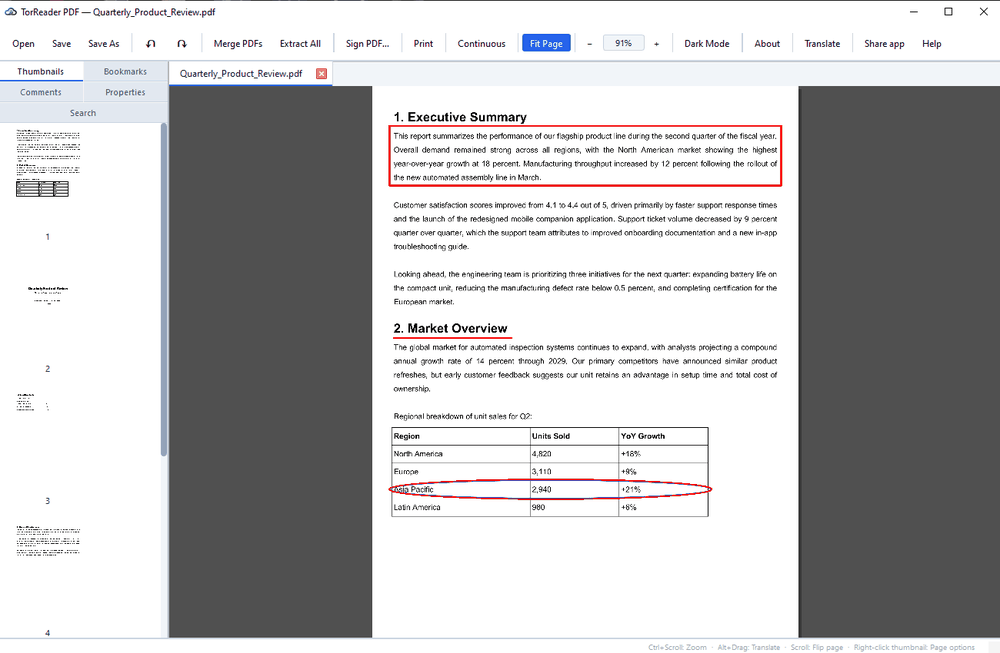
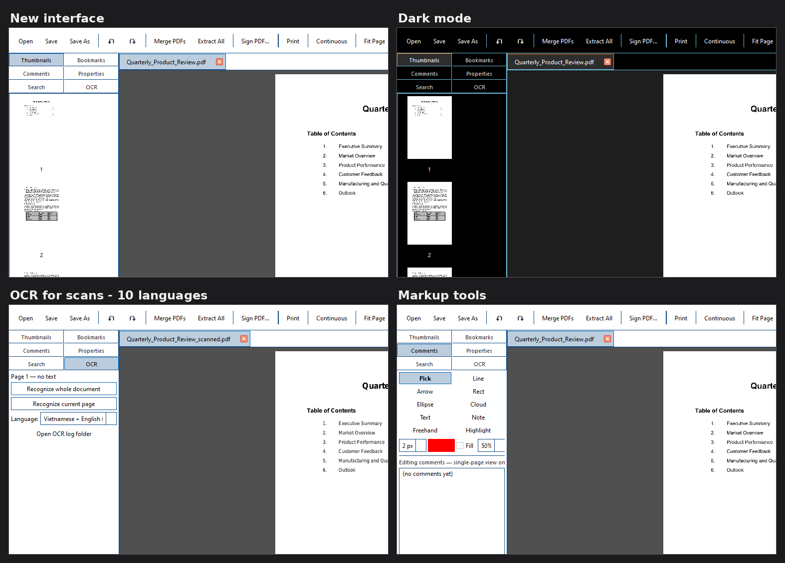
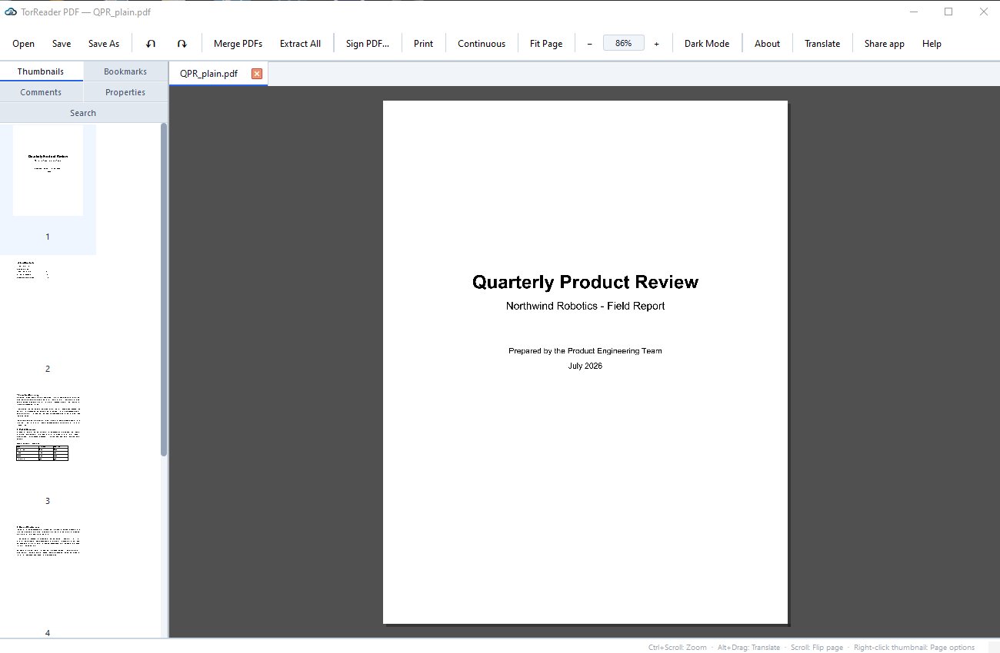
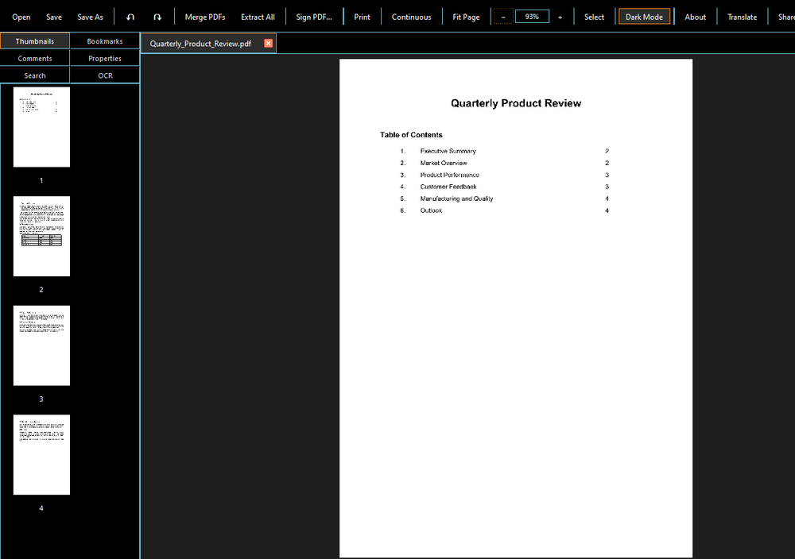
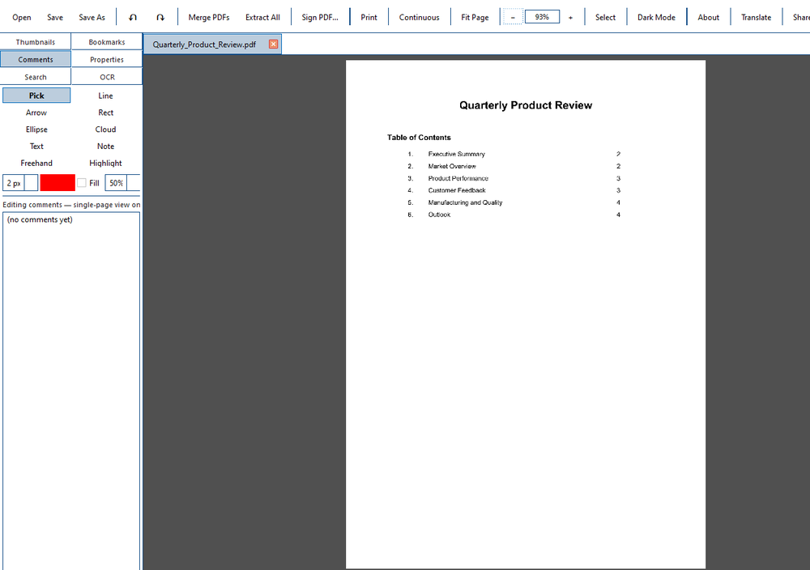
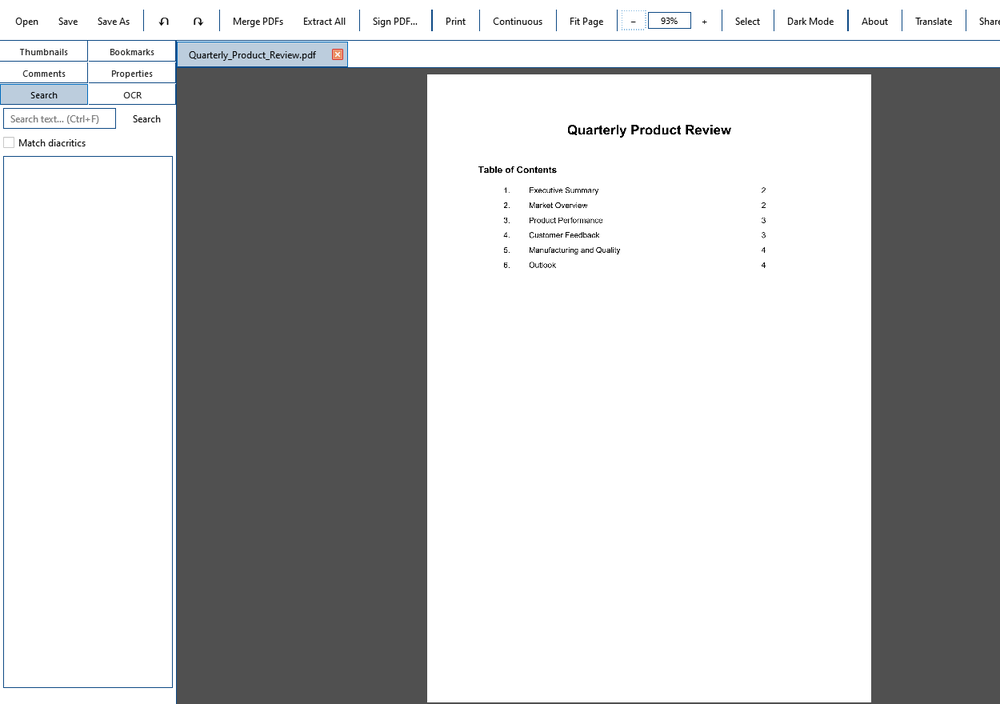
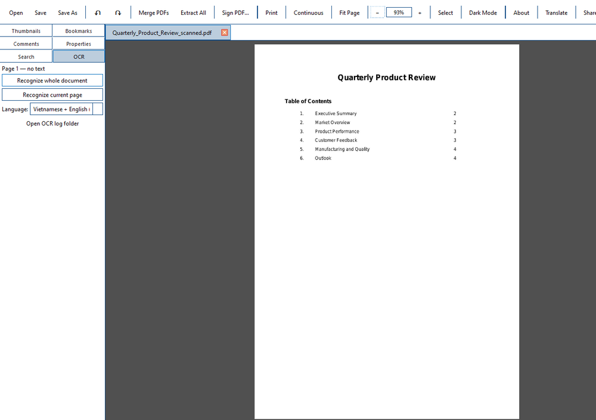
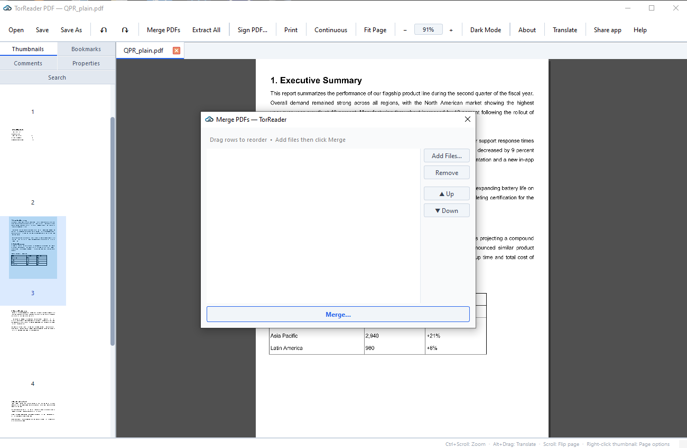

<p align="center">
  <picture>
    <source media="(prefers-color-scheme: dark)" srcset="docs/logo_per_dark.png">
    
  </picture>
</p>

<h1 align="center">TorReader PDF</h1>

<p align="center">
  <a href="https://github.com/FelixNgH/TorreaderPDF/releases/latest"></a>
  <a href="https://github.com/FelixNgH/TorreaderPDF/releases"></a>
  <a href="LICENSE"></a>
  
</p>

A free, portable PDF reader and editor for Windows and Linux, built for people who work with
large technical documents — drawing sets, tender packages, scanned reports — often on machines
where installing software is awkward or not permitted.

No installer, no account, no upload, no internet required. A **300-page A1 CAD set** opens in
one to two seconds and scrolls without freezing: pages render in short interruptible slices
backed by a memory + disk cache, and off-screen pages are evicted so RAM stays flat.



### ✨ What's new in 2.4



- **New interface** — high-contrast light and dark themes, consistent borders and selection
  states, and a neutral desk so the page edge is always visible.
- **OCR for scanned documents — 10 languages.** Vietnamese, English, Chinese (Simplified and
  Traditional), Japanese, Korean, French, Russian, Portuguese, Spanish. Bundled in the app, fully
  offline, and **your file is never modified** — the recognised text lives in memory only.
- **Select, find and copy text — in PDFs and in scans.** Character-level selection across lines
  and pages, double-click for a word, triple-click for a line. Search ignores diacritics by
  default, so `MAT` also finds `MẶT`. Results scroll straight to the match.
- **Links work** — internal links jump and briefly outline the target; external links show the
  full address and ask before opening.
- **Faster** — one shared page cache means a page is parsed once instead of several times.

Full notes: [`RELEASE_NOTES_2.4.md`](RELEASE_NOTES_2.4.md)

<details>
<summary>More screenshots (viewer, dark mode, markup, search, OCR, merge)</summary>
<br>

| | |
|---|---|
|  |  |
|  |  |
|  |  |

</details>

### ⬇ Download

| Platform | Install |
|----------|---------|
| **Windows** (x64) | [`TorReaderPDF-2.4.0-win64.zip`](https://github.com/FelixNgH/TorreaderPDF/releases/latest) — unzip & run `TorReader.exe` |
| **Ubuntu / Debian** (APT) | `sudo mkdir -p /etc/apt/keyrings`<br>`sudo curl -fsSL https://torreader.cloud/apt/torreader-archive-keyring.gpg -o /etc/apt/keyrings/torreader.gpg`<br>`echo "deb [signed-by=/etc/apt/keyrings/torreader.gpg] https://torreader.cloud/apt stable main" \| sudo tee /etc/apt/sources.list.d/torreader.list`<br>`sudo apt update && sudo apt install torreader` |
| **Ubuntu / Debian** (.deb) | `sudo apt install ./torreader_2.4.0_amd64.deb` |
| **Arch Linux** | `yay -S torreader-bin` *(pending publication on AUR)* |
| **Any distro** (AppImage) | [`TorReaderPDF-2.4.0-x86_64.AppImage`](https://github.com/FelixNgH/TorreaderPDF/releases/latest) — `chmod +x` & run (glibc 2.35+, requires system OpenGL) |

Ships a freedesktop `.desktop` file and AppStream metadata, so it appears in your application
menu and in "Open with" for PDFs.

> **🔐 Only two places publish TorReader PDF:**
> [this repository's Releases](https://github.com/FelixNgH/TorreaderPDF/releases) and
> [torreader.cloud](https://torreader.cloud). Anything else is not ours — we have seen this
> project's name and description reused to push generic `Application-x.y.zip` archives on
> third-party sites. Two checks settle it: the link must be on `github.com/FelixNgH/...` or
> `torreader.cloud`, and the file name carries the product name and version
> (`TorReaderPDF-2.4.0-win64.zip`), never a bare `setup.exe`.
> Found a copy elsewhere? [Open an issue](https://github.com/FelixNgH/TorreaderPDF/issues).

## Features

| | |
|---|---|
| **Fast viewer** | Memory-mapped loading; 900MB files in 1–2s. Progressive interruptible rendering, two-layer cache, RAM-efficient continuous scroll, sharp at every zoom with mixed page sizes (A4 + A0–A3 in one file). |
| **OCR** | 10 languages, bundled and offline. Recognised text is searchable, selectable and copyable; the file on disk is untouched. |
| **Text** | Character-level select, diacritic-insensitive find, copy. Works the same in scans after OCR. |
| **Merge** | Combines files **keeping every bookmark**, remapped to new page numbers — most free tools drop them. |
| **Split / Extract / Insert** | Split by page count or size; pull out any range; right-click a thumbnail to insert pages from another PDF, with bookmarks renumbered. |
| **Sign** | PKCS#7 detached, SHA-256, your own `.pfx`/`.p12`. Optional visible stamp placed by dragging. |
| **Markup** | Line, arrow, rectangle, ellipse, cloud, text box, sticky note, freehand, highlight. Colour, width and fill controls; select, move, undo/redo. Correct on rotated pages. |
| **Translate** | Alt+drag over text to translate in place, cached locally. |
| **Pages & bookmarks** | Delete, reorder, rotate; reorder bookmarks. |
| **Safe save** | Edits apply to an in-memory working copy; your original is overwritten only on **Ctrl+S**. |

Dark mode throughout, and full keyboard shortcuts — press **F1** in-app for the list.

## How it compares

An objective look at **24 PDF apps** — paid suites, open-source desktop viewers, self-hosted
toolkits and web tools — across twelve everyday jobs. Sorted A–Z within each group;
TorReader PDF is listed in its category, not on a pedestal.

<details>
<summary><b>Full comparison table — 24 tools × 12 jobs</b> (click to expand)</summary>
<br>

| Tool | Free | Open-source | Portable | Offline | Large/CAD | Merge+Insert | Split+Extract | Sign | Markup | Translate | Win+Linux | **OCR** |
|---|---|---|---|---|---|---|---|---|---|---|---|---|
| **Commercial** | | | | | | | | | | | | |
| ABBYY FineReader PDF | ○ | ○ | ○ | ● | ◐ | ● | ● | ● | ● | ○ | ◐ | ● |
| Adobe Acrobat Pro | ○ | ○ | ○ | ● | ◐ | ● | ● | ● | ● | ○ | ○ | ● |
| Bluebeam Revu | ○ | ○ | ○ | ● | ● | ● | ◐ | ● | ● | ○ | ○ | ● |
| Foxit PDF Editor | ○ | ○ | ○ | ● | ◐ | ● | ● | ● | ● | ○ | ◐ | ● |
| Kofax Power PDF | ○ | ○ | ○ | ● | ◐ | ● | ● | ● | ● | ○ | ◐ | ● |
| Nitro PDF Pro | ○ | ○ | ○ | ● | ◐ | ● | ● | ● | ● | ○ | ○ | ● |
| PDF-XChange Editor | ◐ | ○ | ◐ | ● | ● | ● | ● | ● | ● | ○ | ○ | ● |
| Wondershare PDFelement | ○ | ○ | ○ | ● | ◐ | ● | ● | ● | ● | ◐ | ◐ | ● |
| **Open-source** | | | | | | | | | | | | |
| Evince / GNOME | ● | ● | ○ | ● | ◐ | ○ | ○ | ○ | ◐ | ○ | ◐ | ○ |
| MuPDF | ● | ● | ● | ● | ● | ◐ | ◐ | ○ | ○ | ○ | ● | ○ |
| Okular (KDE) | ● | ● | ◐ | ● | ◐ | ○ | ○ | ◐ | ● | ○ | ● | ○ |
| Qoppa PDF Studio Viewer | ● | ○ | ○ | ● | ◐ | ○ | ○ | ◐ | ● | ○ | ● | ○ |
| Sumatra PDF | ● | ● | ● | ● | ● | ○ | ○ | ○ | ○ | ○ | ○ | ○ |
| **TorReader PDF** | ● | ● | ● | ● | ● | ● | ● | ● | ● | ● | ● | ● |
| Xodo PDF | ● | ○ | ○ | ◐ | ◐ | ● | ● | ● | ● | ○ | ◐ | ◐ |
| **Self-hosted** | | | | | | | | | | | | |
| PDF Arranger | ● | ● | ◐ | ● | ○ | ● | ● | ○ | ○ | ○ | ◐ | ○ |
| pdfcpu | ● | ● | ● | ● | ◐ | ● | ● | ◐ | ○ | ○ | ● | ○ |
| PDFsam Basic | ● | ● | ◐ | ● | ◐ | ● | ● | ○ | ○ | ○ | ● | ○ |
| Stirling-PDF | ● | ● | ◐ | ● | ◐ | ● | ● | ● | ◐ | ○ | ● | ● |
| **Web** | | | | | | | | | | | | |
| Chrome / Edge (PDFium) | ● | ◐ | ○ | ● | ◐ | ○ | ○ | ○ | ◐ | ○ | ● | ○ |
| iLovePDF | ◐ | ○ | ○ | ○ | ◐ | ● | ● | ● | ◐ | ○ | ● | ◐ |
| PDF24 Tools | ● | ○ | ◐ | ◐ | ◐ | ● | ● | ● | ◐ | ○ | ◐ | ● |
| Sejda | ◐ | ○ | ○ | ◐ | ◐ | ● | ● | ● | ● | ○ | ● | ◐ |
| Smallpdf | ◐ | ○ | ○ | ○ | ◐ | ● | ● | ● | ◐ | ○ | ● | ◐ |

</details>

<sub>● full · ◐ partial, limited or paid-tier only · ○ not available. Positioning as of 2026 —
feature sets vary by version and licence tier; verify the current release before deciding.
Source data: [`docs/compare_matrix.csv`](docs/compare_matrix.csv).</sub>

## FAQ

**Is it free?** Yes — free and open-source (MIT). No ads, no account, no watermark.

**Do I need to install it?** No. Unzip and run on Windows; `chmod +x` the AppImage on Linux.

**Does it work offline?** Yes, including OCR. Only the optional translate feature calls an
online service, and only when you use it.

**Can it merge without losing bookmarks?** Yes — merging and inserting keep every bookmark and
remap it to the new page numbers.

**What does OCR do?** It turns a scanned page into text you can search, select and copy —
10 languages, entirely offline, and your file is never modified. Table structure recognition is
on the roadmap.

**A free alternative to Adobe Acrobat, PDFsam or Foxit?** For viewing, OCR, merging, splitting,
extracting, inserting, signing and translating — yes, in one lightweight portable app.

## Building from source

**Requirements:** CMake ≥ 3.25 · Qt 6 (Core, Widgets, Gui, Concurrent, PrintSupport, OpenGL,
OpenGLWidgets, Network) · QPDF ≥ 11 · **PDFium** prebuilt from
[bblanchon/pdfium-binaries](https://github.com/bblanchon/pdfium-binaries/releases) extracted into
`third_party/pdfium/` · *optional* OpenSSL (enables Sign PDF) · *optional* Tesseract (enables OCR).
Optional dependencies are skipped cleanly when absent.

```powershell
# Windows — Visual Studio Build Tools 2022 + vcpkg
vcpkg install qpdf openssl
cmake -B build -DCMAKE_TOOLCHAIN_FILE=C:/vcpkg/scripts/buildsystems/vcpkg.cmake
cmake --build build --config Release      # -> build/bin/Release/TorReader.exe
```

```bash
# Debian / Ubuntu
sudo apt install cmake qt6-base-dev libqt6opengl6-dev libqt6openglwidgets6 \
                 libqpdf-dev liblcms2-dev libssl-dev libtesseract-dev
cmake -B build && cmake --build build -j$(nproc)   # -> build/bin/TorReader
```

## Architecture

- **Rendering & structural editing** — [PDFium](https://pdfium.googlesource.com/pdfium/)
  (BSD 3-Clause): merge, split, insert, extract, reorder, rotate.
- **Bookmarks & compression** — [QPDF](https://github.com/qpdf/qpdf) (Apache-2.0), lossless
  object-stream compression on save.
- **OCR** — [Tesseract](https://github.com/tesseract-ocr/tesseract) (Apache-2.0); recognised text
  is inserted as invisible text objects into the in-memory document only.
- **UI** — Qt 6 Widgets + OpenGL (`PdfGpuView` single page, `ContinuousView` scroll strip).
- All `FPDF_*` calls are serialized behind a global mutex — PDFium is not thread-safe.

See `THIRD_PARTY_NOTICES.md` for the full dependency list and licences.

## License

MIT for TorReader PDF's own source ([LICENSE](LICENSE)); third-party dependencies keep theirs.

## Author

**Felix Nguyen Huy ([@FelixNgH](https://github.com/FelixNgH))** ·
[torreader.cloud](https://torreader.cloud) ·
[BIMServer.cloud](https://bimserver.cloud) — BIM infrastructure for architecture firms ·
[@FelixNgHuy](https://twitter.com/FelixNgHuy)

Issues and pull requests welcome.
