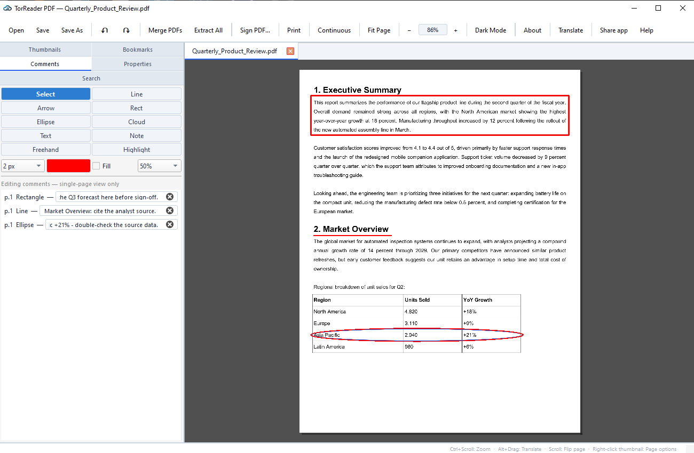
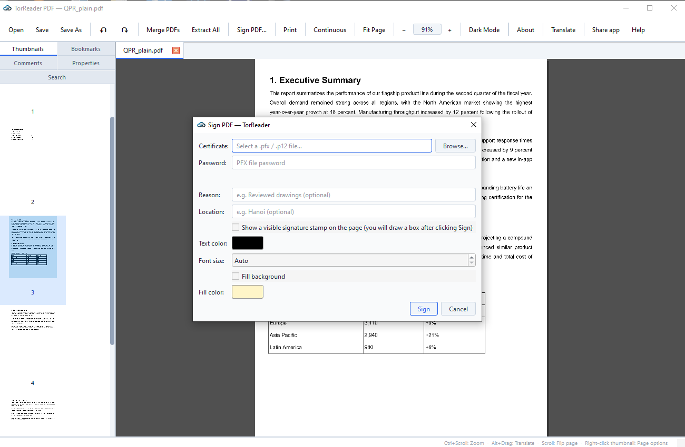
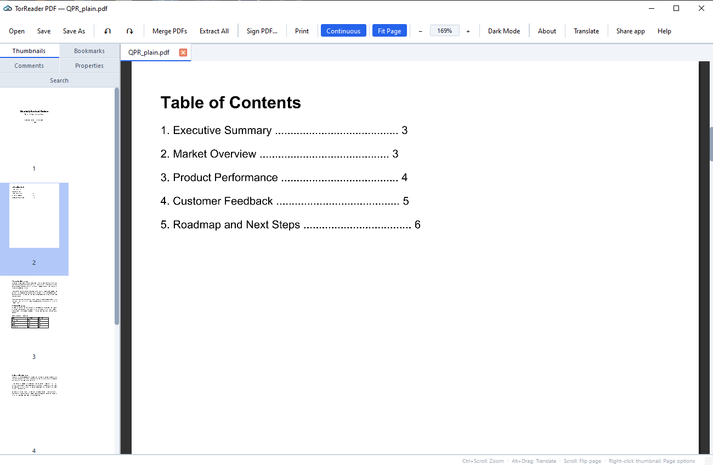
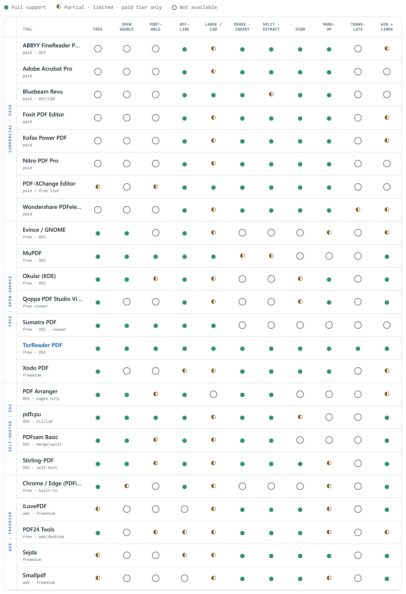

# TorReader PDF

[](https://github.com/FelixNgH/TorreaderPDF/releases/latest)
[](https://github.com/FelixNgH/TorreaderPDF/releases)
[](LICENSE)


TorReader PDF is a free, portable PDF reader and editor for Windows and Linux.
It opens large documents quickly, and it does the everyday jobs without a
subscription: merge, split, extract and insert pages, annotate, sign with a
certificate, and translate text in place.

Everything runs locally on your own machine. There is no installer, no account,
no upload, and no internet connection required — unzip it (or `chmod +x` the
AppImage) and run it. A 900MB drawing set opens in one to two seconds, merging
keeps every bookmark, and the whole thing is open source under the MIT licence.

It was built for people who work with large technical documents — drawing sets,
tender packages, scanned reports — on machines where installing software is
awkward or not permitted.

### 🚀 Built for large, multi-hundred-page drawing sets

TorReader stays smooth on the files that make other viewers crawl — a **300-page
A1 CAD drawing set** opens fast, scrolls and pages **without freezing**, and keeps
memory low. The renderer draws each page in short, interruptible slices so the UI
never blocks, backs it with a two-layer (memory + disk) cache, and evicts
off-screen pages so RAM stays flat no matter how many pages you flip through.

### 🔐 Official downloads — please read

There are only **two** places that publish TorReader PDF:

| Source | URL |
|---|---|
| This repository's Releases | https://github.com/FelixNgH/TorreaderPDF/releases |
| The official website | https://torreader.cloud |

Anything else is not ours. In particular, a page that calls itself an "official
releases page" but sends you to a generic archive such as `Application-x.y.zip`
on a third-party site is **not** TorReader PDF, whatever it is named. We have seen
copies of this project's name and description used that way.

Two checks that take five seconds and settle it:

- **The download link must be on `github.com/FelixNgH/...` or `torreader.cloud`.** Nowhere else.
- **The file name carries the product name and version** — `TorReaderPDF-2.3.0-win64.zip`,
  `torreader_2.3.0_amd64.deb`, `TorReaderPDF-2.3.0-x86_64.AppImage`. Never a generic
  `Application-*.zip` or a bare `setup.exe`.

If you find a copy being distributed elsewhere, please
[open an issue](https://github.com/FelixNgH/TorreaderPDF/issues) — it helps protect
other people looking for this app.

### ⬇ Download

| Platform | Install |
|----------|---------|
| **Windows** (x64) | [`TorReaderPDF-2.3.0-win64.zip`](https://github.com/FelixNgH/TorreaderPDF/releases/latest) — unzip & run `TorReader.exe` |
| **Ubuntu / Debian** (APT repo) | `sudo mkdir -p /etc/apt/keyrings`<br>`sudo curl -fsSL https://torreader.cloud/apt/torreader-archive-keyring.gpg -o /etc/apt/keyrings/torreader.gpg`<br>`echo "deb [signed-by=/etc/apt/keyrings/torreader.gpg] https://torreader.cloud/apt stable main" \| sudo tee /etc/apt/sources.list.d/torreader.list`<br>`sudo apt update && sudo apt install torreader`<br>→ auto-updates via `apt upgrade` |
| **Ubuntu / Debian** (standalone .deb) | Download `.deb` from [Releases](https://github.com/FelixNgH/TorreaderPDF/releases) & run:<br>`sudo apt install ./torreader_2.3.0_amd64.deb` |
| **Arch Linux** | `yay -S torreader-bin` *(pending publication on AUR)* |
| **Any distro** (AppImage) | [`TorReaderPDF-2.3.0-x86_64.AppImage`](https://github.com/FelixNgH/TorreaderPDF/releases/latest) — `chmod +x` & run (glibc 2.35+, Ubuntu 22.04+; requires system OpenGL) |

The app ships a freedesktop-compatible `.desktop` file and AppStream metadata, so it appears in your application menu and "Open with" for PDF files.

See all versions on the **[Releases page](https://github.com/FelixNgH/TorreaderPDF/releases)**.

### ✨ What's new in 2.3

- **Instant sharpness on heavy CAD drawings.** The page's vector geometry is uploaded
  to the GPU and drawn directly, so zooming and panning are sharp immediately instead
  of waiting for a re-render. On a 2.18-million-path drawing, a viewport re-render
  costs ~2 seconds and does not get cheaper at lower resolution — the GPU draws it at
  once.
- **GPU rendering in Continuous scroll too** — the same `VectorGpuRenderer` layer
  is shared with the single-page view, so scrolling through heavy pages no longer
  re-rasterises them. Markups in Continuous are display-only (with popups); to
  select or edit markup, switch to single-page view.
- **True line weights and dashes.** Stroke widths, dash patterns, fills and clipping
  are respected, so drawings keep their line hierarchy instead of coming out as
  uniform hairlines.
- **Text stays exact.** Text is rendered with the document's own embedded fonts, so
  accented scripts — including Vietnamese — are correct at any zoom.
- **A comment on every markup.** Line, arrow, rectangle, ellipse, cloud, freehand and
  highlight all carry popup text now. Type it inline in the Comments list
  (`p.4  Arrow  —  …`), see it as a popup when you select the markup, with full
  undo/redo.
- **Fit Page** centres the page; **Translate** region select moved to `Alt`+drag
  (`Ctrl`+drag was colliding with zoom); larger undo/redo buttons; **Share app** button
  with a copyable download link.

Full release notes: [`RELEASE_NOTES_2.3.md`](RELEASE_NOTES_2.3.md)




<details>
<summary>More screenshots (viewer, dark mode, markup, digital signature, merge)</summary>
<br>

| | |
|---|---|
|  |  |
|  |  |
|  |  |

</details>

<!-- Prebuilt binaries and the web version are also at torreader.cloud -->

## Features

- **Fast PDF viewer, built for large drawing sets** — memory-mapped loading opens 900MB files in 1–2s; **300-page A1 CAD sets** scroll and page without freezing thanks to progressive interruptible rendering + a two-layer cache; continuous scroll is RAM-efficient (off-screen pages evicted), sharp at every zoom even with mixed page sizes (A4 + A0–A3 in one file)
- **Merge PDF** — combine files while **keeping every bookmark**, remapped to the new page numbers (most tools drop them); unbookmarked pages get an auto "Page N" entry
- **Split PDF** — split a document into parts by page count or size
- **Extract pages** — pull any page or range out into a new PDF
- **Insert pages** — Adobe-style, right-click a thumbnail to insert pages from another PDF; bookmarks renumber to match
- **Sign PDF** — digital signature, PKCS#7 detached, SHA-256, using your own `.pfx`/`.p12` certificate; optional visible signature stamp, placed by dragging then confirmed with "Finalize Signature"
- **Comments (markup)** — Line, Arrow, Rectangle, Ellipse, Cloud, Text box, and sticky Note tools with colour/width/fill controls; select, move, and undo/redo any markup. Text boxes support adjustable **font size and colour** (right-click → Properties), and all markup lands correctly on **rotated pages**
- **Translate PDF (free)** — Ctrl+drag over text to translate it in place, cached locally
- **Delete / Reorder pages**, reorder bookmarks
- **Dark mode**, full keyboard shortcuts (press **F1** in-app for the full list)
- **Safe save model** — edits (insert/delete/reorder/merge) apply to an in-memory working copy first; your original file is only overwritten when you press **Ctrl+S**

## How it compares

An objective look at **24 PDF apps** — paid suites, open-source desktop viewers, self-hosted
toolkits and web tools — across 11 everyday jobs. Tools are sorted A–Z within each group;
TorReader is listed in its category, not on a pedestal.



<sub>● full support · ◐ partial, limited or paid-tier only · ○ not available. General positioning as of 2026 — feature sets vary by version and licence tier; verify the current release before deciding.</sub>

## FAQ

**Is TorReader free?** Yes — free and open-source (MIT). No ads, no account, no watermark.

**Do I need to install it?** No. It's a portable app: on Windows, unzip and run
`TorReader.exe`; on Linux, `chmod +x` the AppImage and run it.

**Does it work offline?** Yes — all PDF viewing and editing (merge, split, extract,
insert, sign) happens locally on your machine. Only the optional translate feature
calls an online translation service when you use it.

**Can it merge PDFs without losing bookmarks?** Yes. Merging (and inserting pages)
keeps every bookmark and remaps it to the new page numbers — a common problem with
other free tools.

**What platforms are supported?** Windows 10/11 (x64) and Linux (x86_64, AppImage).

**Is it a free alternative to Adobe Acrobat, PDFsam or Foxit?** For viewing, merging,
splitting, extracting, inserting, signing and translating PDFs — yes, TorReader
covers those jobs in a single lightweight, portable app.

## Building from source

### Requirements (both platforms)
- CMake ≥ 3.25
- Qt 6 (Core, Widgets, Gui, Concurrent, PrintSupport, OpenGL, OpenGLWidgets, Network)
- QPDF ≥ 11 (dev headers)
- **PDFium** prebuilt binaries — download from
  [bblanchon/pdfium-binaries releases](https://github.com/bblanchon/pdfium-binaries/releases)
  and extract into `third_party/pdfium/` (must contain `include/`, `lib/`,
  and on Windows `bin/pdfium.dll`)
- *(optional)* OpenSSL dev headers — enables the "Sign PDF" feature. Skipped
  cleanly if not found.
- *(optional)* Tesseract OCR dev headers — enables OCR search on scanned pages.

### Windows
```powershell
# Requires Visual Studio Build Tools 2022 + vcpkg (for QPDF/OpenSSL)
vcpkg install qpdf openssl
cmake -B build -DCMAKE_TOOLCHAIN_FILE=C:/vcpkg/scripts/buildsystems/vcpkg.cmake
cmake --build build --config Release
# → build/bin/Release/TorReader.exe
```

### Linux
```bash
# Debian/Ubuntu example
sudo apt install cmake qt6-base-dev libqt6opengl6-dev libqt6openglwidgets6 \
                  libqpdf-dev liblcms2-dev libssl-dev
cmake -B build
cmake --build build -j$(nproc)
# → build/bin/TorReader
```

Building without `libssl-dev` installed works fine — the Sign PDF feature is
simply disabled at configure time (see the CMake status message).

## Architecture

- **Rendering & structural editing**: [PDFium](https://pdfium.googlesource.com/pdfium/) (BSD 3-Clause) — merge, split, insert, extract, reorder, rotate all go through `FPDF_ImportPagesByIndex` and friends.
- **Bookmark/outline writing + compression**: [QPDF](https://github.com/qpdf/qpdf) (Apache-2.0) — object-stream compression on save, lossless.
- **UI**: Qt 6 Widgets + OpenGL (`PdfGpuView` single-page view, `ContinuousView` scroll strip).
- **Thumbnails & previews**: rendered by PDFium through a shared render pool; the main view always uses PDFium for full-resolution, correctly laid-out rendering.
- All `FPDF_*` calls are serialized behind a global mutex — PDFium is not thread-safe.

See `THIRD_PARTY_NOTICES.md` for the full list of dependencies and their licenses.

## License

TorReader's own source code is [MIT-licensed](LICENSE). Third-party
dependencies keep their own licenses — see `THIRD_PARTY_NOTICES.md`.

## Author

Built by **Felix Nguyen Huy ([@FelixNgH](https://github.com/FelixNgH))**.

- Web: [torreader.cloud](https://torreader.cloud)
- Also building: [BIMServer.cloud](https://bimserver.cloud) — BIM infrastructure for architecture firms
- Twitter: [@FelixNgHuy](https://twitter.com/FelixNgHuy)

Issues and pull requests welcome.
